# SEQUENCE DIAGRAMS – FLUTTER LEPRACHECK APP

> Semua diagram dalam format **PlantUML**.
> Untuk me-render, gunakan [PlantUML Online](https://www.plantuml.com/plantuml/uml/) atau plugin VS Code PlantUML.

---

## DAFTAR ISI

1. [SD-01: App Launch & Routing (Splash → Home/Welcome)](#sd-01-app-launch--routing-splash--homewelcome)
2. [SD-02: Alur Onboarding (Pertama Kali)](#sd-02-alur-onboarding-pertama-kali)
3. [SD-03: Alur Deteksi Lengkap (Kamera → Hasil → Simpan)](#sd-03-alur-deteksi-lengkap-kamera--hasil--simpan)
4. [SD-04: Alur Deteksi – Galeri (Pilih Foto → Hasil → Simpan)](#sd-04-alur-deteksi--galeri-pilih-foto--hasil--simpan)
5. [SD-05: Proses Inferensi ML (TFLite + Fallback Remote)](#sd-05-proses-inferensi-ml-tflite--fallback-remote)
6. [SD-06: Simpan Laporan dengan Data Pasien & GPS](#sd-06-simpan-laporan-dengan-data-pasien--gps)
7. [SD-07: Lihat & Filter Riwayat](#sd-07-lihat--filter-riwayat)
8. [SD-08: Lihat Detail Riwayat & Buka Peta](#sd-08-lihat-detail-riwayat--buka-peta)
9. [SD-09: Hapus Riwayat (Satu Entri)](#sd-09-hapus-riwayat-satu-entri)
10. [SD-10: Hapus Semua Riwayat](#sd-10-hapus-semua-riwayat)
11. [SD-11: Lihat Konten Edukasi (Artikel & Video)](#sd-11-lihat-konten-edukasi-artikel--video)
12. [SD-12: Baca Detail Artikel Edukasi](#sd-12-baca-detail-artikel-edukasi)

---

## SD-01: App Launch & Routing (Splash → Home/Welcome)

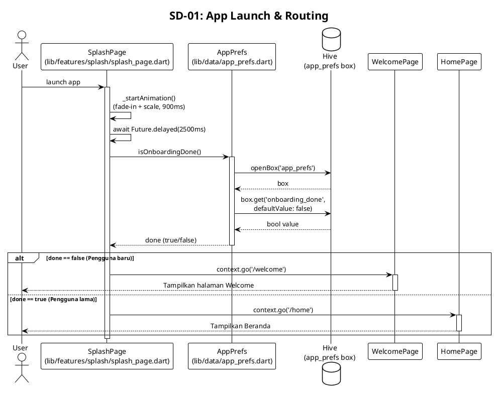

---

## SD-02: Alur Onboarding (Pertama Kali)

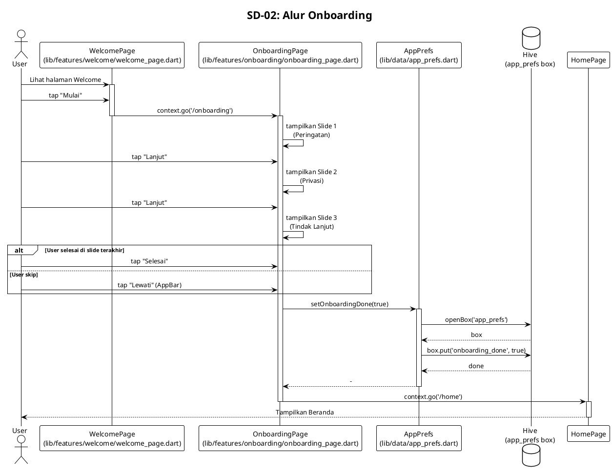

---

## SD-03: Alur Deteksi Lengkap (Kamera → Hasil → Simpan)

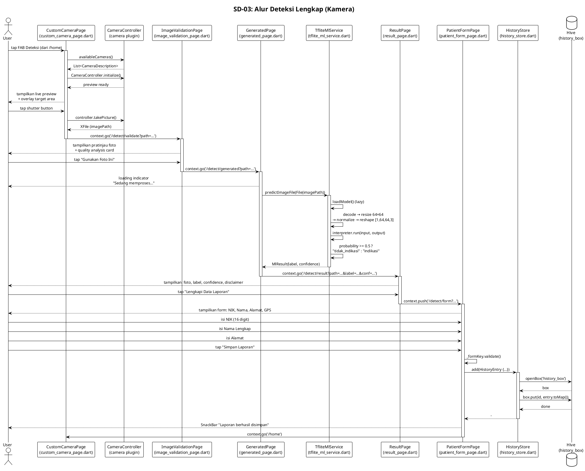

---

## SD-04: Alur Deteksi – Galeri (Pilih Foto → Hasil → Simpan)

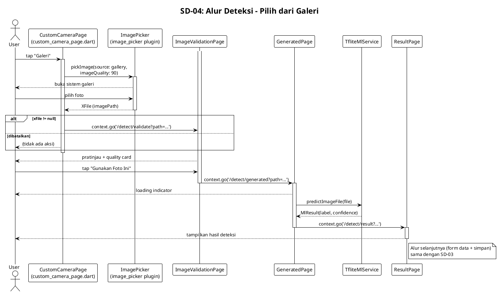

---

## SD-05: Proses Inferensi ML (TFLite + Fallback Remote)

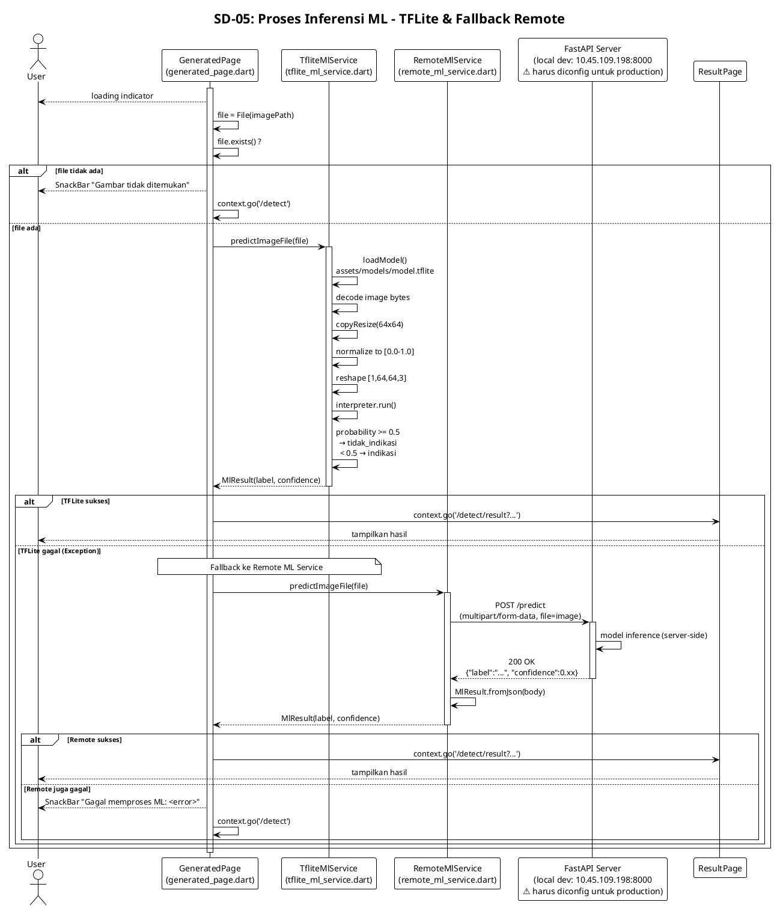

---

## SD-06: Simpan Laporan dengan Data Pasien & GPS

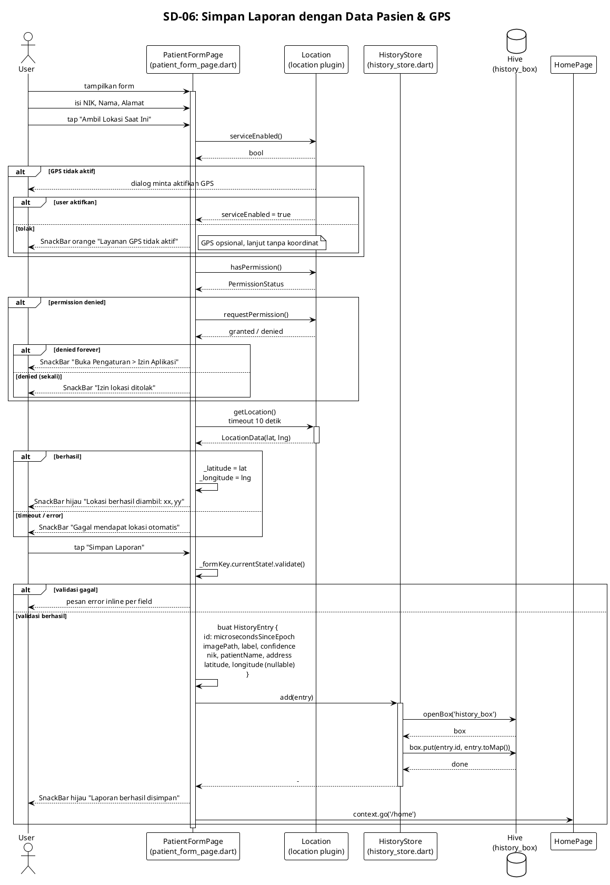

---

## SD-07: Lihat & Filter Riwayat

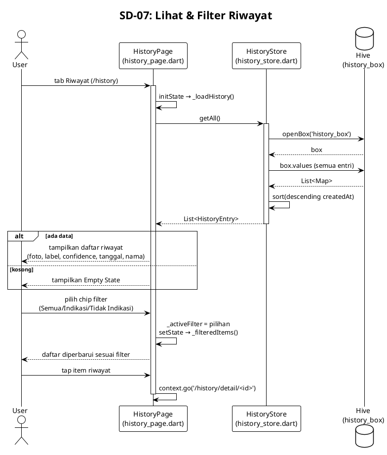

---

## SD-08: Lihat Detail Riwayat & Buka Peta

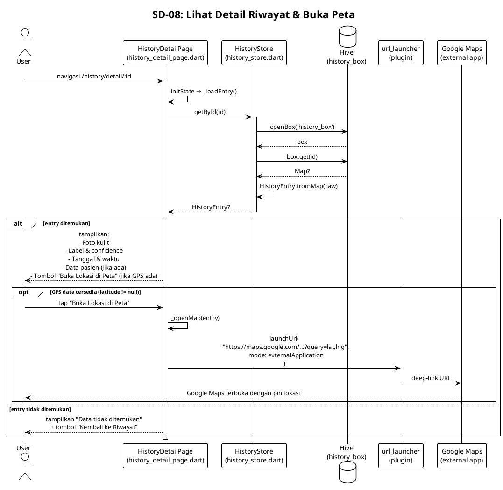

---

## SD-09: Hapus Riwayat (Satu Entri)

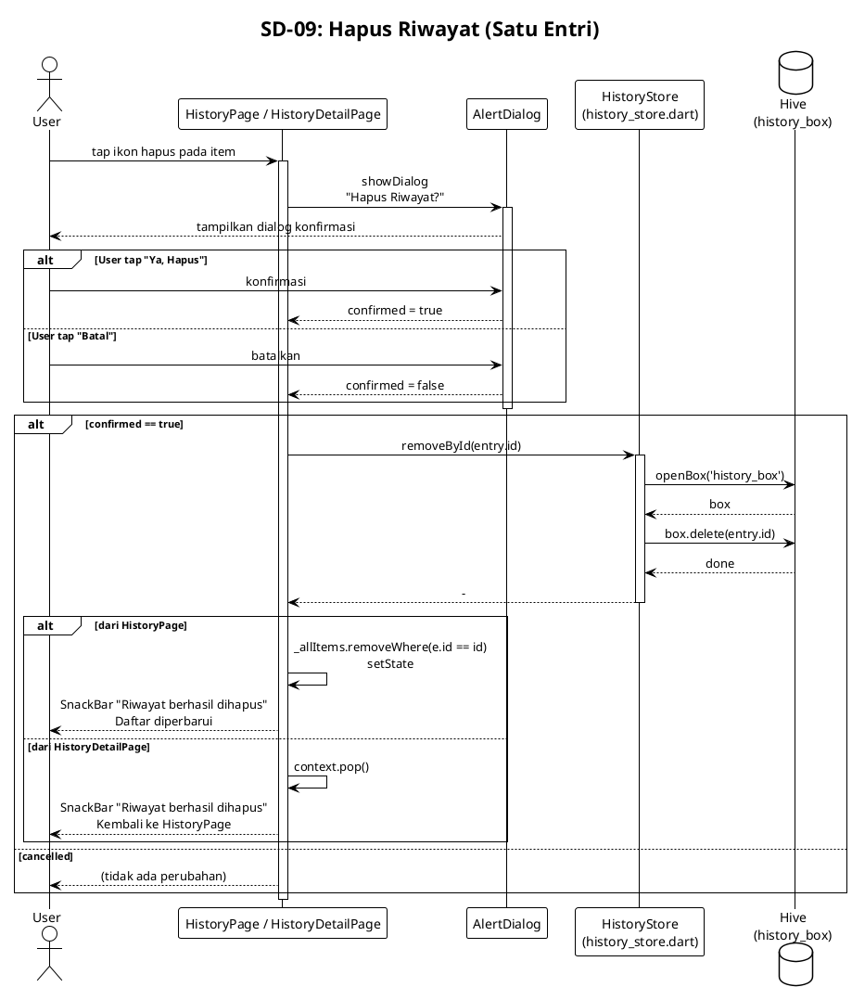

---

## SD-10: Hapus Semua Riwayat

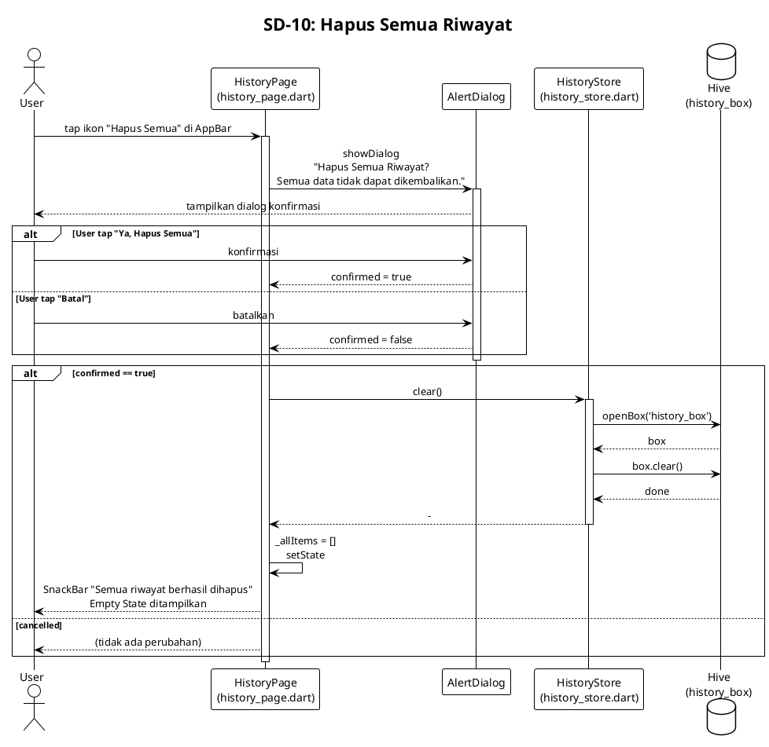

---

## SD-11: Lihat Konten Edukasi (Artikel & Video)

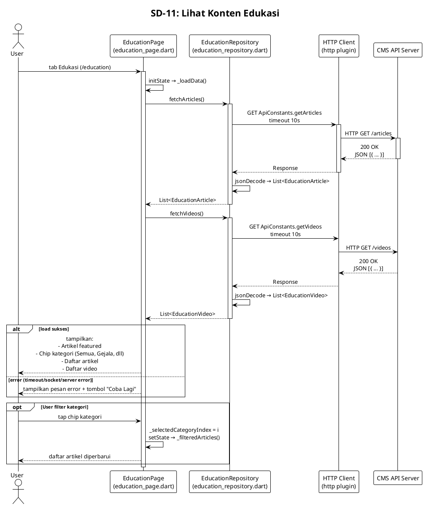

---

## SD-12: Baca Detail Artikel Edukasi

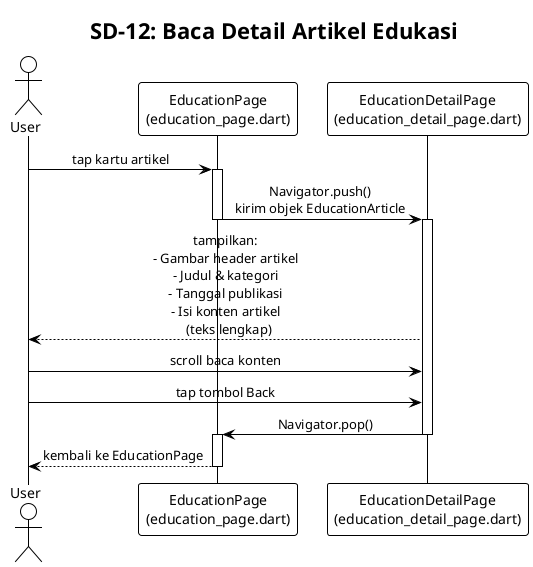

---

## Catatan Implementasi

| Diagram | File Utama | Library Kunci |
|---------|-----------|---------------|
| SD-01 | `splash_page.dart`, `app_prefs.dart` | hive, go_router |
| SD-02 | `welcome_page.dart`, `onboarding_page.dart` | hive, go_router |
| SD-03 | `custom_camera_page.dart` → ... → `patient_form_page.dart` | camera, go_router, tflite_flutter, hive |
| SD-04 | `custom_camera_page.dart` (galeri path) | image_picker, go_router, tflite_flutter |
| SD-05 | `generated_page.dart`, `tflite_ml_service.dart`, `remote_ml_service.dart` | tflite_flutter, http |
| SD-06 | `patient_form_page.dart`, `history_store.dart` | location, hive |
| SD-07 | `history_page.dart`, `history_store.dart` | hive |
| SD-08 | `history_detail_page.dart` | hive, url_launcher |
| SD-09 | `history_page.dart`, `history_detail_page.dart` | hive |
| SD-10 | `history_page.dart` | hive |
| SD-11 | `education_page.dart`, `education_repository.dart` | http |
| SD-12 | `education_detail_page.dart` | - |
